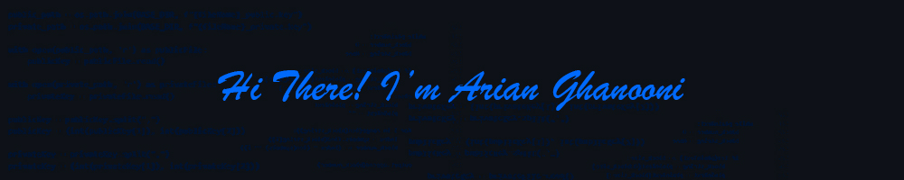

<picture>
 <source media="(prefers-color-scheme: dark)" srcset="Image/Untitled-1.jpg">
 <source media="(prefers-color-scheme: light)" srcset="Image/Untitled-2.jpg">
 
</picture>

💻 **Computer Software Engineering Student | Backend Developer (Python)**  

---

## 🚀 About Me
I'm a passionate and motivated Computer Engineering student with a focus on **Software Engineering**.  
Currently, I’m building a strong foundation in **backend development with Python**, while also exploring databases and frameworks like **Django**. Alongside coding, I actively share my **personal projects** on GitHub to document my journey.  

---

## 💡 What Drives Me
I love understanding **how things work at a deep level**—especially in tech. Solving problems through code and seeing ideas turn into reality is what excites me the most.  

---

## 📫 Let’s Connect
- 🌐 [GitHub](https://github.com/ArianGhanooni)  
- 💼 [LinkedIn](https://www.linkedin.com/in/arnghn/)

---

⭐️ *“Stay curious, keep building, and never stop learning.”*  

<picture>
 <source media="(prefers-color-scheme: dark)" srcset="https://github-readme-stats.vercel.app/api?username=ArianGhanooni&hide=contribs&show_icons=true&theme=transparent">
 <source media="(prefers-color-scheme: light)" srcset="https://github-readme-stats.vercel.app/api?username=ArianGhanooni&hide=contribs&show_icons=true&theme=default">
 
</picture>

<picture>
 <source media="(prefers-color-scheme: dark)" srcset="https://github-readme-stats.vercel.app/api/top-langs/?username=ArianGhanooni&layout=compact&theme=transparent">
 <source media="(prefers-color-scheme: light)" srcset="https://github-readme-stats.vercel.app/api/top-langs/?username=ArianGhanooni&layout=compact&theme=default">
 
</picture>
